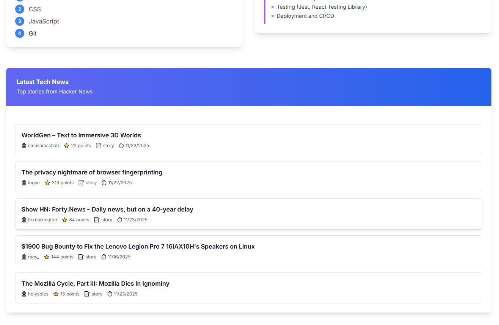

# 📘 Skill Gap Analysis & Career Roadmap Generator

This project analyzes a user’s current skills, identifies gaps for a target career role, generates a 3-phase career roadmap, and displays top tech news using the public HackerNews API.

---

# 🚀 Live Demo

**Frontend Hosted**: [Frontend](https://skill-gap-analysis-code-at-random.vercel.app/)  
**Backend Hosted**: [Backend](https://skill-gap-analysis-codeatrandom.onrender.com)

---

# 🧰 Tech Stack
**Frontend**

- React (Vite)
- TailwindCSS
- Custom hooks (use-mobile, use-toast)
- Fetch API

**Backend**

- Node.js
- Express.js
- CORS
- Modular MVC Structure (Controllers, Services, Routers)

**External API**

- HackerNews Public API

---

# 📄 Features
**✔ Career Goal Input Page**

- Target Role input
- Current Skills input
- "Analyze My Career Path" button

**✔ Skill Gap Analyzer API**

Backend returns:  
- Matched Skills
- Missing Skills
- Recommendations
- Learning Order

**✔ Career Roadmap Generator**

Three phases including:
- Duration
- Topics
- Role-specific guidance

**✔ Tech News Integration**

- Displays top 5 latest tech stories.

**✔ Combined Dashboard**

- Left: Skill Gap
- Right: Roadmap
- Bottom: Tech News

---

**⚙️ How to Run the Project**  

**🖥 Backend Setup**
1. Navigate to backend
```
cd backend
```

2. Install dependencies
```
npm install
```

3. Create .env file
```
PORT=3000
PING_MESSAGE=ping
```

4. Start backend
```
node server.js
```

Backend running at:
```
http://localhost:3000
```

**🌐 Frontend Setup**
1. Navigate to frontend
```
cd frontend
```

2. Install dependencies
```
npm install
```

3. Start frontend
```
npm run dev
```

Frontend running at:
```
http://localhost:5173
```

---

**📡 API Documentation**  

**🔹 POST `/api/skill-gap`**  
**Request Body**
```json
{
  "targetRole": "Frontend Developer",
  "currentSkills": ["HTML", "CSS"]
}
```

**Response**
```json
{
  "matchedSkills": [],
  "missingSkills": [],
  "recommendations": [],
  "suggestedLearningOrder": []
}
```

**🔹 POST `/api/roadmap`**
**Request Body**
```json
{
  "targetRole": "Backend Developer"
}
```

**Response**
```json
{
  "role": "Backend Developer",
  "phases": [
    { "phase": 1, "topics": [] },
    { "phase": 2, "topics": [] },
    { "phase": 3, "topics": [] }
  ]
}
```

**🔹 GET `/api/hackernews`**
**Response**
```json
{
  "stories": [
    {
      "title": "",
      "url": "",
      "score": 0,
      "time": 1700000000,
      "type": "story",
      "by": "author"
    }
  ]
}
```

---

**📂 Backend Folder Structure**
```
backend/
│── server.js
│── src/
│   ├── app.js
│   ├── controllers/
│   │   ├── skillGap.controller.js
│   │   ├── roadmap.controller.js
│   │   ├── hackerNews.controller.js
│   ├── services/
│   │   ├── skillGap.service.js
│   │   ├── roadmap.service.js
│   │   └── hackerNews.service.js
│   ├── routers/
│   │   ├── skillGap.routes.js
│   │   ├── roadmap.routes.js
│   │   └── hackerNews.routes.js
```

**🎨 Frontend Folder Structure**
```
frontend/
│── src/
│   ├── App.jsx
│   ├── main.jsx
│   ├── pages/
│   │   ├── Index.jsx
│   │   ├── Dashboard.jsx
│   │   └── NotFound.jsx
│   ├── hooks/
│   │   ├── use-toast.jsx
│   │   └── use-mobile.jsx
│   ├── lib/
|   |   └── utils.js
│   └── index.css
```
---

**📸 Screenshots**

Landing Page:


Dashboard – Skill Gap & Roadmap


Dashboard – Tech News


---

**📝 Assumptions**

- Role names are case-insensitive.
- Skills compared using lowercase matching.
- Only the first 30 HackerNews stories are checked.
- No database used (assignment permitted in-memory/JSON).
- If tech news fails, skill gap + roadmap still render.